#  — Archi-platform for biographical content
<sub>🗓️ Developed in January 2026</sub>

This project is a **structured platform developed with HTML5 & CSS3**, composed of four pages: `index.html`, `cataleg.html`, `fitxa.html`, and `blog.html`, along with additional assets such as CSS stylesheets in `/css` and images in `/img`.  
The goal was to solidify the concepts from CSS Layout and Responsive Design, presenting well-organized HTML documents using semantic elements, Flexbox, and CSS Grid.

---

## ✅ Features

- **Semantic HTML5 structure** across all pages, including `<!DOCTYPE html>`, `<html lang="ca">`, `<head>`, `<body>`, `<header>`, `<nav>`, `<main>`, and `<footer>`.
- **Semantic content organization** using `<article>` (in `fitxa.html` and `blog.html`) and `<section>` (across all pages) with proper heading hierarchy (`h1`, `h2`, `h3`, `h4`) and text elements (`p`, `span`).
- **List structures** including unordered lists (`ul`, `li`) for navigation menus, category filters, and footer links, as well as description lists (`dl`, `dt`, `dd`) in `fitxa.html` to display film data.
- **Semantic text elements** for clarity: `<cite>` for work titles, `<abbr>` for acronyms with full descriptions on hover, and `<i>` for visual emphasis and foreign-language terms.
- **Forms and interactive elements**: `<form>`, `<label>`, `<input>` (text and email types), and `<button>` used for the newsletter footer and a simulated search bar with placeholder and icon.
- **Multimedia and embedded content**: images (``), inline video frames (`<iframe>`), organized within semantic `<figure>` and `<figcaption>` containers.
- **CSS reset and global configuration**: Universal margin/padding reset and `box-sizing: border-box` for consistent layout control.
- **CSS custom properties**: Variables for colors, font families, and font weights defined in `:root` for easy reuse across all stylesheets.
- **HTML5 tag redefinition**: Customized base styles for `body`, `abbr`, `h1–h4`, and `p` to ensure typographic consistency (using *Playfair Display* and *Inter* fonts).
- **Structural layout classes**: `.full-width` for full-viewport sections (header, footer, hero) and `.inner` for a centered reading container (max-width: 1000px with auto lateral margins).
- **Responsive design with a mobile-first strategy**: Base styles for small screens progressively enhanced via media queries at tablet (768px) and desktop (1024px) breakpoints, using Flexbox for linear layouts and CSS Grid for two-dimensional structures.
- **Accessibility and validation**: All HTML files validated with [W3C Validator](https://validator.w3.org/) and CSS validated with [W3C CSS Validator](https://jigsaw.w3.org/css-validator/) — no errors or warnings found across all pages.

---

## 🛠 Installation & Setup

### 1. Clone the repository
```bash
git clone https://github.com/marcturu/biopic-archive.git
```

### 2. Try the webpage locally
Open the `.html` files directly in a browser or use **Live Server**.

The webpage will typically be available at `http://127.0.0.1:5500/`.

---

## 📂 Documentation

All additional documentation is in the `/DOCS` directory:
- **HTML entities**
- **CSS styles**
- **Significant aportations**
- **Accessibility and validation** 

---
## 📷 Screenshots 

### Index (Desktop):
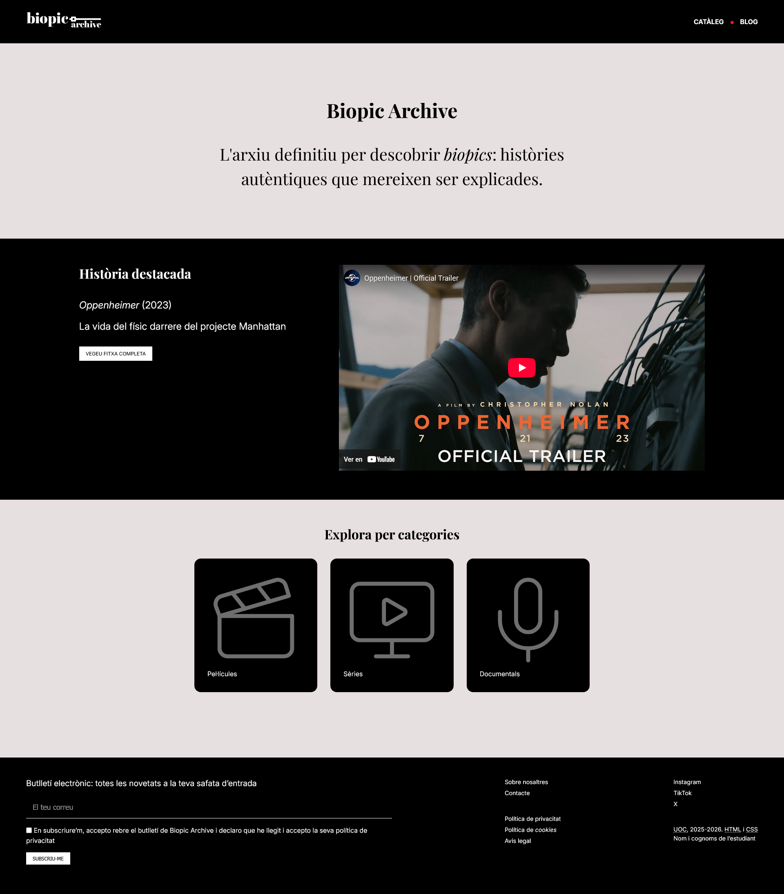

### Catàleg (Desktop):
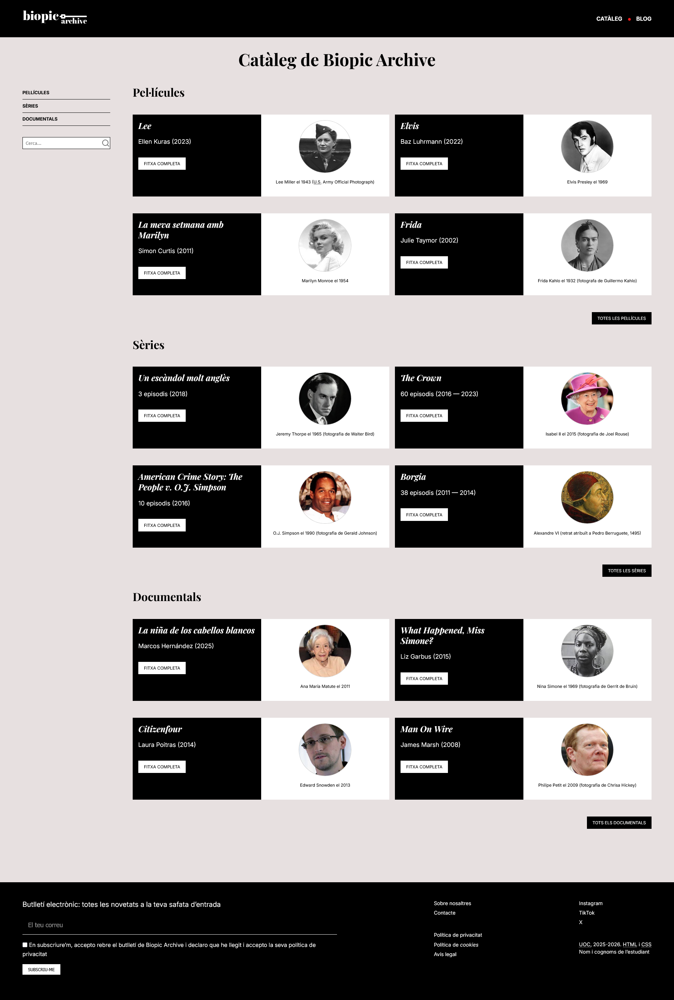

### Fitxa (Desktop):
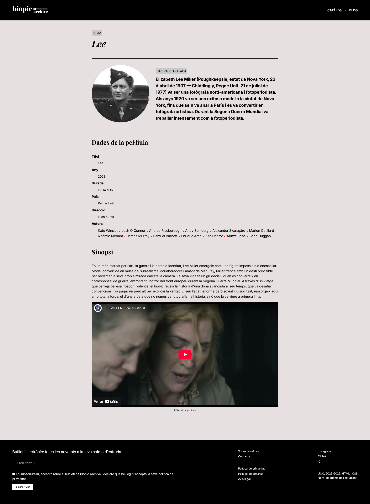

### Blog (Desktop):
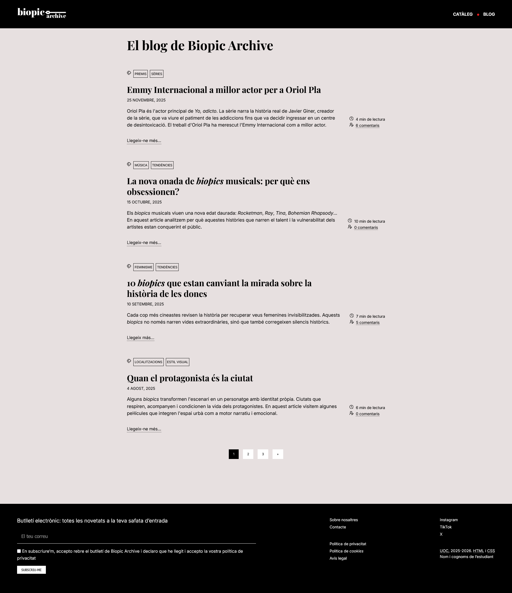

### Index (Tablet):
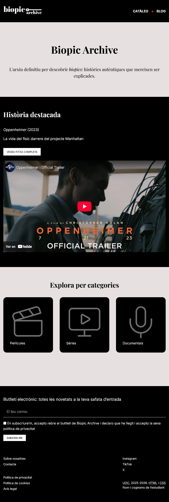

### Catàleg (Tablet):
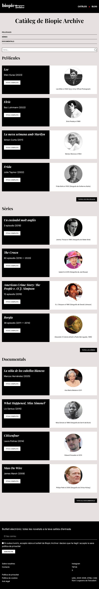

### Fitxa (Tablet):
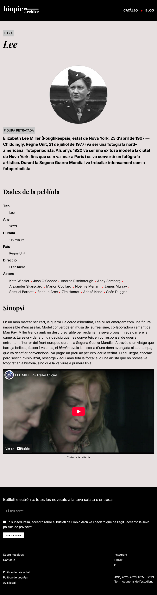

### Blog (Tablet):
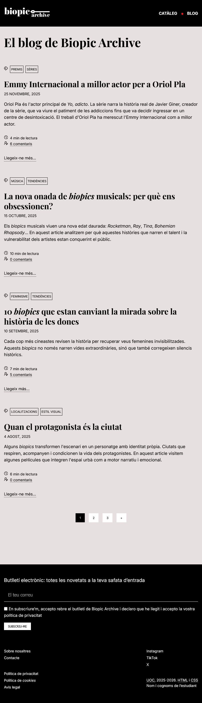

### Index (Mobile):
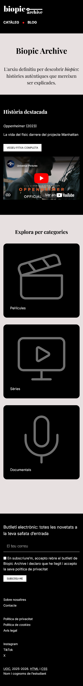

### Cataleg (Mobile):
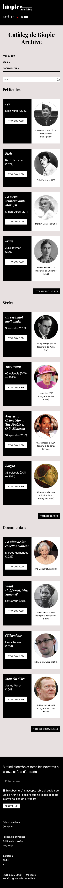

### Fitxa (Mobile):
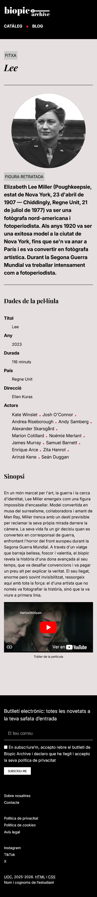

### Blog (Mobile):
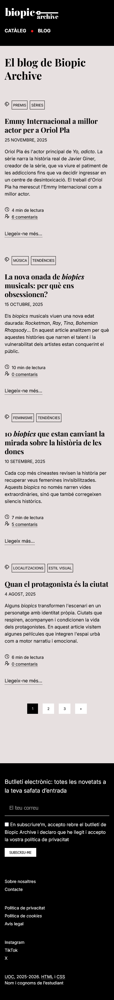

---

## ⚖️ Copyright & License

© 2026 Marc Turu Roca. All rights reserved.

This project and its contents are the exclusive intellectual property of Marc Turu Roca.  
All rights reserved. No part of this project may be copied, modified, distributed, or used without prior written permission from the author.
